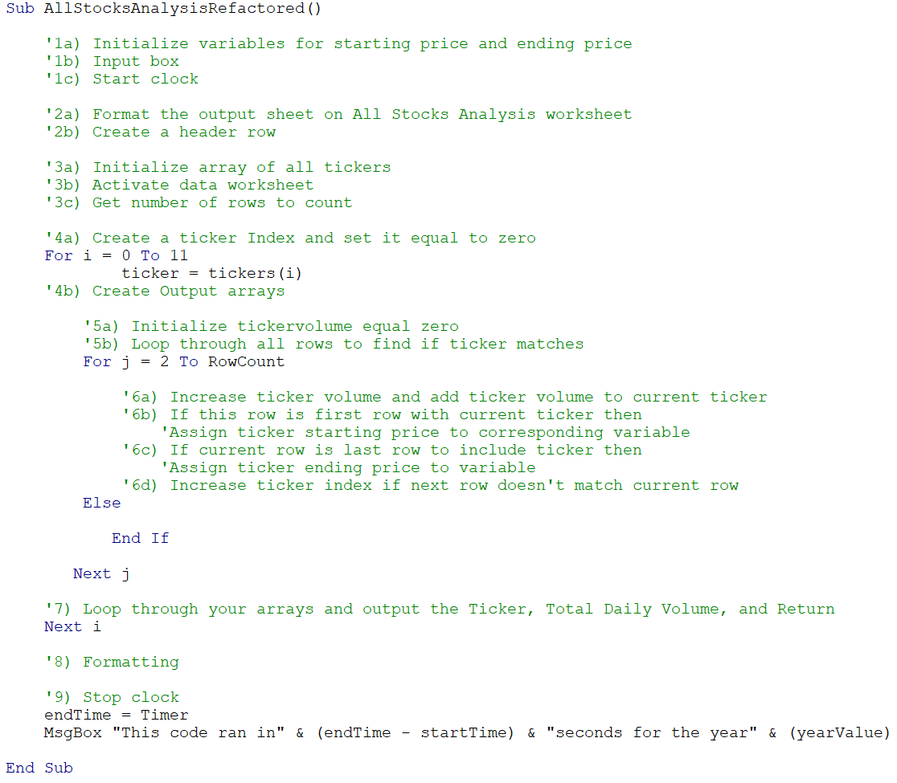

# Stock Analysis Outcomes

## Overview of Project
- Refactor the All Stocks Anaysis code to loop through a handful of green-energy stock data in order to collect data. Then, determine if refactoring made the VBA script run more efficiently.   

## Analysis and Challenges
 
### Outline of Script
- In order to achieve a more efficient script, first, I created an outline of what the refactored could should look like.
     

### Challenges and Difficulties Encountered
- One challenging part about completing the analysis was finding the balance between reusing and refactoring past code. Additionally, there were instances when I began to overthink and added too many variables to my script, which broke my code. I eventually realized that concise code ran more quickly and efficiently.

## Comparison

### Code
- The first difference between the refactored and original code is the new code begins by initializing variables for starttime and endtime, whereas the original did not assign a data type to the variable.

-Next, in the refactored code, the ticker index is created and set equal to zero before the output arrays are defined.

-Additionally, there a 3 output arrays in the refactored code, but in the original, only two arrays are defined. The variable for totalvolume was not assigned a data type in the original. To expand on this difference, both the start time and end time variables in the original script are defined as single. However, in the refactored script both were assigned as double.

-Lastly, in the refactored script, I avoided an extra for loop by using an Else statement. Meaning, if the next row’s ticker doesn’t match the previous row’s ticker, then do nothing and  move on to the next ticker index (i).

