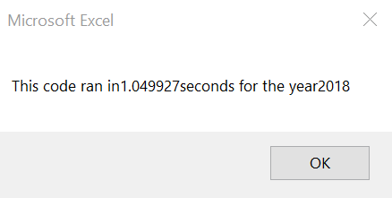
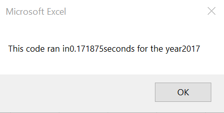

# Stock Analysis Outcomes

## Overview of Project
Refactor the All Stocks Anaysis code to loop through a handful of green-energy stock data in order to collect data. Then, determine if refactoring made the VBA script run more efficiently.   

## Analysis and Challenges
 
### Outline of Script
In order to achieve a more efficient script, first, I created an outline of what the refactored could should look like.

### Challenges and Difficulties Encountered
One challenging part about completing the analysis was finding the balance between reusing and refactoring past code. There were instances when I began to overthink and added too many variables to my script, which broke my code. I eventually realized that what I needed was focus on single for loops, and not nested "if-statements," as too many nested formulas can impact code performance. Additionally, I used "tickerindex" as a variable, but instead of looping through each ticker one time (12 total), I assigned the 12 ticker values to each output array. This allowed for my refactored code to loop over all rows **once** and store data in the respective arrays. You can view the comparison between my first refactored code, `AllStocksAnalysisRefactored`  and the updated version `AllStocksAnalysisRefactored2` below:

[AllStocksAnalysisRefac_vs_AllStocksAnalysisRefacRefac2.pdf](Resources/AllStocksAnalysisRefac_vs_AllStocksAnalysisRefacRefac2.pdf)

## Comparison

### Stock Year to Year Comparison
The first thing I notice is the stark difference between the years. In 2017, most returns seem profitable with "DQ" earning a 199.99% return rate. That same year, "TERP" was the only stock to go red at -7.2% return. 

 

On the other hand, the next year, 2018, seems to be a dismal year for stock earning as only 2 stocks were in the green, "ENPH" and "RUN", both earning less than 85%. "TERP" consistently performed poorly with an average of -6.1% across both years. It is worth to note, "ENPH" and "RUN" were the only two stocks to go green both years. From 2017-2018, "RUN" increased by 78.5% and "ENPH" dropped nearly 48 points. Therefore, "RUN" is the only stock to improve numbers from one year to the next. 

### Execution Time Comparison
I ran each version of code 3 different times, since code runs slower the first time around. The collected dataset corresponds to the third round. 

#### Original Script
From the following screengrabs, you can see the original version of the code had almost identical elapsed times for 2017 and 2018.

 

#### Refactored Script
The refactored script had similar elapsed times for 2017 and 2018, and both execution times improved by approximately 50 milliseconds with the new code.

### Summary
The benefits of refactoring code are apparent. It can help programming run faster, assist in debugging, and it can make code easier to understand. This is clear in the above example, where the refactored script ran more effciently. In fact, the code was executed in less than one second. This may not seem like an outstanding improvement, as the original code ran in just over a second, but milliseconds can add up if you run the code consecutively and over an extended amount of time. I would say one disadvantage of refactoring is if you accidentally place an indent or make a typo, it can alter your dataset or even break the code. To be honest, I had trouble getting the refactored code to run without issue. When I stepped into the code, I also took the opportunity to reformat. However, this hasty decision caused my code to break. Then, I had to spend time debugging my debug. Therefore, refactoring code can be fairly time consuming, so you must think about all possible and necessary variables and outcomes ahead of time. It's a good idea to create an outline as to not get lost in the code. Staying organized with annotations is key.
